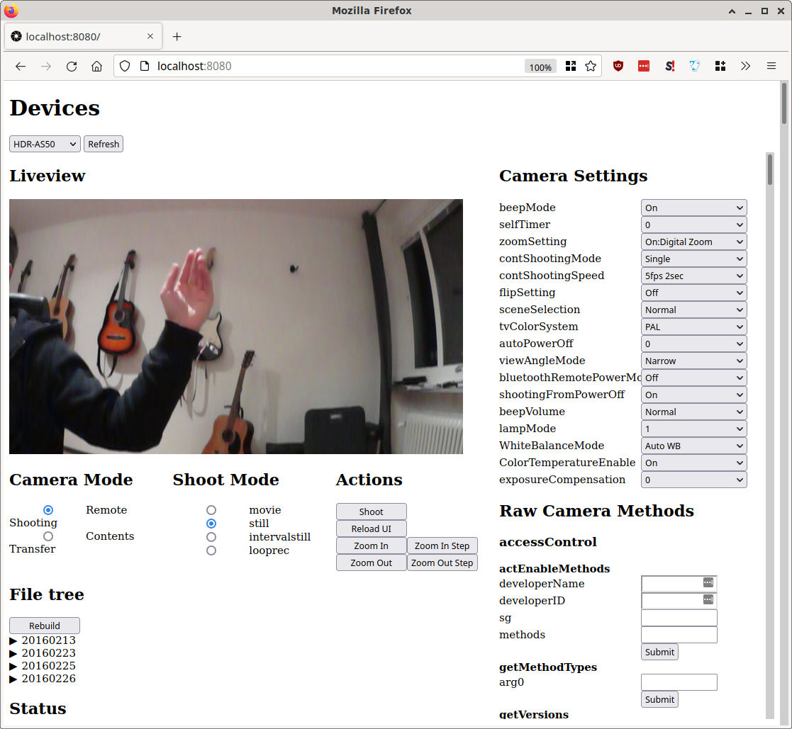

# Sony Remote Camera API Python Bindings

The motivation for this is quite simple: I own a Sony HDR AS50, a rather nice
little action camera. However, I'm no longer really using it "actively", so I
figured I would try to repurpose it for something else, such as a turning it
into a webcam or network camera. My hope was that I would eventually use it to
provide a live-feed for my 3D printer as well as using it for 3D printer
time-lapses.

**Unfortunately** Sony has a horrible track-record for implementing standards
such as UVC or even basic USB picture transfers, making it very hard to use this
camera together with programs such as [ghoto2](http://www.gphoto.org/). Sony
does however implement a custom API for controlling the cameras, which you can
(for now...) find [here](https://developer.sony.com/develop/cameras/). Do note
that this is different to the [Sony Remote
SDK](https://support.d-imaging.sony.co.jp/app/sdk/en/index.html), which it
*seems* like they will eventually supersede this API with for newer
devices. Nevertheless, there are a still a number of devices on the market using
the "old" one, so for the time being, this might be useful for some.


# Device Auto Discovery

First, the device discovery is a bit more reliable compared to other projects:
By binding to all recognized network interfaces independently, it appears to be
easier to gather a list of all devices that matches the Sony Imaging Device SSDP
service type.

# Method Auto Discovery

One interesting feature in Python is that it is relatively easy to create new
class methods dynamically, thus, instead of manually creating a list of
supported methods, the device will crawl over all endpoints that it finds, the
methods that the device itself supports. These methods are in turn used to
implement a number of applications:

# Applications

## Installation

To install the package and the following applications use `pip`:

```
pip install sony-camera-server
```


## Local Camera Web-server

This is arguably the most important feature of this project: Create a web-server
for interacting with the camera, as seen below:

```
venv/bin/sony-camera-server
```



As should be evident from the above, most settings can be accessed and changed
and will be updated after each such change.

One of the slightly unique features of this API is that it was intended to be an
actual server: The links in the file-tree will actually download and forward the
media from the camera to the browser client. Thus, if the server is run on e.g.,
a Raspberry Pi and be accessed on a browser somewhere else, the media should
still be forwarded correctly.

The "raw" methods that the API exposes can also be accessed, however the UI does
not track the state changes after those calls, and please note that some of them
can even leave your camera in a broken state, so use them with caution! I am not
liable for any damage your device may suffer from use of this software.

Also note that this was built using the built-in Python HTTP server, thus: **DO
NOT RUN THIS ON AN UNTRUSTED NETWORK!**


## Snap Pictures

This was intended as a quick replacement for typical
[ghoto2](http://www.gphoto.org/) scripts: Detect the camera, take a picture and
optionally download it using either the "postview" feature or with the original
quality.

```
> ls
docs  img  LICENSE  README.md  src
> venv/bin/sony-snap-picture --delete
> ls
docs  img  LICENSE  pict160229_2308040000.JPG  README.md  src
> venv/bin/sony-snap-postview --delete out.jpeg
> ls
docs  img  LICENSE  out.jpeg  pict160229_2308040000.JPG  README.md  src
>
```

## Dump File Tree

Lastly, I wanted a simple method for quickly dumping all media present on the
device, for which this script basically does. Depending on flags, it will dump
either in a 'flat' view, or a 'date' view.

```
> venv/bin/sony-media-transfer -f date
> tree HDR-AS50/
HDR-AS50/
├── 20160213
│   ├── DSC00193.JPG
│   ├── DSC00194.JPG
│   ├── DSC00195.JPG
│   └── DSC00196.JPG
├── 20160223
│   └── DSC00197.JPG
├── 20160225
│   └── MAH00198.MP4
├── 20160226
│   ├── DSC00201.JPG
│   ├── MAH00199.MP4
│   └── MAH00200.MP4
└── 20160229
    ├── DSC00203.JPG
    ├── DSC00204.JPG
    └── MAH00207.MP4
```

## Erase All Files

As advertised: Delete all files on the selected device. It will prompt before
executing the command but use with caution to avoid data-loss!

```
> venv/bin/sony-media-erase --device-name HDR-AS50
```


# Unimplemented Features

Barring bugs, most features that the API supports should be
implemented. However, I personally have not found a reasonable use-case for the
"streaming" API, i.e., letting the camera play video files, streaming decoded
JPEG frames to the client. Thus, I haven't put any effort into implementing any
support for that.

The 'continuous shooting mode' is currently not implemented.

Currently, the raw API will not properly find most parameter candidates if the
camera is started in "Contents Transfer" mode. This appears to be a limitation
in the cameras themselves, as the API does not mention anything regarding this.

Note also that other cameras should support a lot more settings than the HDR
AS50, but as of right now I have no way of testing any of those.


# Possible Camera Bugs

The HDR AS50 currently goes into a non-responsive state if the camera view angle
mode is changed from wide to narrow while in the "intervalstill" shooting mode.

Rapidly sending commands to a camera and/or requesting it to change camera
function (transfer/remote-shooting) may cause the camera to become partially
unresponsive (no longer shooting, menus not working, etc). This is presumably
some kind of live-lock on the camera, which requires pulling out the battery to
resolve. This problem prompted the development of the device cache to reduce the
number of calls to the device during setup.
